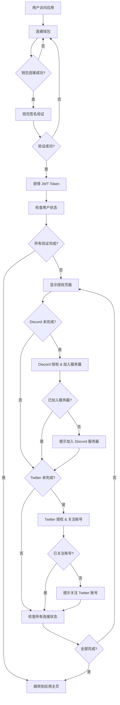

# 前端登录集成指南

## 概述

本指南详细说明了前端应用的完整登录流程，包括钱包连接、Discord/Twitter 授权验证，以及整个用户身份验证的前端实现方案。

## 🎯 完整登录流程概览



## 📋 流程步骤详解

> **⚠️ 重要提示：完整验证要求**
> 
> 本系统要求用户完成以下**所有**验证步骤才能正常使用：
> - ✅ **钱包连接**：连接并验证钱包身份
> - ✅ **Discord 验证**：授权登录 **且** 加入指定 Discord 服务器
> - ✅ **Twitter 验证**：授权登录 **且** 关注指定 Twitter 账号
>
> 只有当 `allConnected: true` 时，用户才能访问完整功能。

### 1. 钱包连接与登录

用户首先需要连接钱包并完成签名验证以获得身份认证。

**流程：**
1. 用户点击"连接钱包"按钮
2. 选择钱包(MetaMask, WalletConnect等)
3. 获取钱包地址
4. 请求签名 nonce
5. 用户钱包签名
6. 验证签名并获得 JWT Token

### 2. 用户状态检查

钱包登录成功后，需要检查用户的 Discord 和 Twitter 连接状态。

**流程：**
1. 使用钱包地址查询用户状态
2. 检查 `discordConnected` 和 `twitterConnected` 状态
3. 检查 `isJoined` (Discord服务器) 和 `isFollowed` (Twitter关注) 状态
4. 根据状态决定是否需要进行授权验证

### 3. Discord/Twitter 授权验证

如果用户尚未完成 Discord 或 Twitter 连接，引导用户进行授权。

**Discord 验证要求：**
- 用户必须授权登录 Discord (`discordConnected`)
- 用户必须加入指定的 Discord 服务器 (`isJoined`)

**Twitter 验证要求：**
- 用户必须授权登录 Twitter (`twitterConnected`)
- 用户必须关注指定的 Twitter 账号 (`isFollowed`)

**流程：**
1. 显示授权页面，列出未完成的连接
2. 用户点击 Discord/Twitter 授权按钮
3. 跳转到对应的 OAuth 页面
4. 用户完成授权后，系统自动检查服务器加入/账号关注状态
5. 更新用户连接状态

### 4. 完成后跳转

所有验证完成后，用户可以正常使用应用功能。

**流程：**
1. 检查 `allConnected` 状态（要求所有条件都满足）
   - `walletConnected: true`
   - `discordConnected: true` && `isJoined: true`
   - `twitterConnected: true` && `isFollowed: true`
2. 如果全部完成，跳转到应用主页
3. 如果部分完成，提示用户完成剩余步骤

## 🔧 核心API接口

### 1. 钱包登录相关

#### 获取签名 Nonce
**接口:** `GET /auth/wallet/nonce?walletAddress=0x...`

**响应:**
```json
{
  "nonce": "abc123def456",
  "message": "Please sign this message to verify your wallet: abc123def456",
  "expiresAt": "2024-01-01T10:40:00.000Z"
}
```

#### 验证钱包签名并登录
**接口:** `POST /auth/wallet/verify`

**请求体:**
```json
{
  "walletAddress": "0x1234...",
  "nonce": "abc123def456",
  "signature": "0x123abc..."
}
```

**响应:**
```json
{
  "verified": true,
  "walletAddress": "0x1234...",
  "access_token": "eyJhbGciOiJIUzI1NiIs...",
  "user": {
    "id": "clj123456789",
    "walletAddress": "0x1234...",
    "discordConnected": false,
    "twitterConnected": false,
    "walletConnected": true,
    "isJoined": false,
    "isFollowed": false,
    "allConnected": false,
    "status": "NORMAL"
  }
}
```

### 2. 用户状态查询

#### 获取用户状态
**接口:** `GET /auth/user/status-by-wallet?walletAddress=0x...`

**参数:**
- `walletAddress` (必需): 以太坊钱包地址

**响应:**
```json
{
  "vibeUserId": "clj123456789",
  "walletAddress": "0x1234567890123456789012345678901234567890",
  "status": {
    "discord": {
      "connected": true,
      "username": "user#1234",
      "userId": "123456789",
      "verified": true,
      "isJoined": true,
      "connectedAt": "2024-01-01T10:30:00.000Z"
    },
    "twitter": {
      "connected": true,
      "username": "dollyuser",
      "userId": "987654321",
      "verified": true,
      "isFollowed": true,
      "connectedAt": "2024-01-01T10:35:00.000Z"
    },
    "wallet": {
      "connected": true,
      "walletAddress": "0x1234567890123456789012345678901234567890",
      "verifiedAt": "2024-01-01T10:25:00.000Z"
    },
    "overall": {
      "allConnected": true,
      "completedAt": "2024-01-01T10:35:00.000Z",
      "canProceed": true
    }
  }
}
```

**状态字段说明:**
- `discord.connected`: 是否已授权登录 Discord
- `discord.isJoined`: 是否已加入指定 Discord 服务器
- `twitter.connected`: 是否已授权登录 Twitter  
- `twitter.isFollowed`: 是否已关注指定 Twitter 账号
- `wallet.connected`: 是否已连接并验证钱包
- `overall.allConnected`: 是否完成所有验证步骤
- `overall.canProceed`: 是否可以进入应用主功能

### 3. Discord 授权相关

#### 获取 Discord OAuth 授权链接
**接口:** `GET /auth/discord/oauth-url?walletAddress=0x...`

**响应:**
```json
{
  "oauthUrl": "https://discord.com/api/oauth2/authorize?client_id=...&redirect_uri=...&response_type=code&scope=identify+guilds&state=...",
  "walletAddress": "0x1234567890123456789012345678901234567890"
}
```

#### Discord OAuth 回调处理
**接口:** `GET /auth/discord/callback?code=...&state=...`

**响应:**
```json
{
  "success": true,
  "discordId": "123456789",
  "username": "user#1234",
  "isInGuild": true,
  "walletAddress": "0x1234567890123456789012345678901234567890",
  "message": "Discord connection successful! You are a member of the 0G Discord server.",
  "note": "isInGuild 必须为 true 才算完成验证"
}
```

#### 检查 Discord 连接状态
**接口:** `GET /auth/discord/status?discordId=123456789`

**响应:**
```json
{
  "connected": true,
  "username": "user#1234",
  "userId": "123456789",
  "verified": true,
  "connectedAt": "2024-01-01T10:30:00.000Z"
}
```

### 4. Twitter 授权相关

#### 获取 Twitter OAuth 授权链接
**接口:** `GET /auth/twitter/oauth-url?walletAddress=0x...`

**响应:**
```json
{
  "oauthUrl": "https://api.twitter.com/oauth/authorize?oauth_token=...",
  "walletAddress": "0x1234567890123456789012345678901234567890"
}
```

#### Twitter OAuth 回调处理
**接口:** `GET /auth/twitter/callback?oauth_token=...&oauth_verifier=...`

**响应:**
```json
{
  "success": true,
  "twitterId": "987654321",
  "username": "dollyuser",
  "isFollowing": true,
  "walletAddress": "0x1234567890123456789012345678901234567890",
  "message": "Twitter connection successful! You are now following our account.",
  "note": "isFollowing 必须为 true 才算完成验证"
}
```

## 🌐 环境变量配置

后端需要配置以下环境变量：

```bash
# Discord OAuth 配置
DISCORD_CLIENT_ID="你的Discord应用Client ID"
DISCORD_CLIENT_SECRET="你的Discord应用Client Secret"
DISCORD_REDIRECT_URI="https://yourdomain.com/auth/discord/callback"
DISCORD_GUILD_ID="你的Discord服务器ID"
```

## 💻 前端实现逻辑

### 1. 核心组件结构

前端应用需要实现以下核心组件和逻辑：

#### 认证服务层 (AuthService)
- 封装所有 API 调用，包括钱包验证、用户状态查询、OAuth URL 获取
- 管理 JWT Token 的存储和请求头设置
- 处理网络请求错误和重试逻辑

#### 钱包连接 Hook (useWalletLogin)
- 检测钱包插件(MetaMask)是否安装
- 请求用户连接钱包并获取地址
- 获取签名 nonce 并引导用户签名
- 验证签名并获取 JWT Token
- 管理连接状态和错误信息

#### 用户状态 Hook (useUserStatus)  
- 根据钱包地址查询用户完整状态
- 定期刷新状态以获取最新的连接信息
- 缓存状态数据以减少不必要的请求

#### 登录流程组件 (LoginFlow)
- 管理整个登录流程的状态机：钱包连接 → 授权验证 → 完成
- 显示进度指示器，标明已完成和待完成的步骤
- 根据用户状态动态显示相应的操作按钮
- 处理 Discord/Twitter OAuth 重定向

### 2. 状态管理逻辑

#### 登录状态判断
检查 `status.overall.allConnected` 字段来判断用户是否完成所有验证：
- 钱包连接：`status.wallet.connected === true`
- Discord 验证：`status.discord.connected === true && status.discord.isJoined === true`  
- Twitter 验证：`status.twitter.connected === true && status.twitter.isFollowed === true`

#### 步骤流转控制
- **步骤1-钱包连接**：用户未连接钱包时显示连接按钮
- **步骤2-授权验证**：钱包已连接但未完成社交媒体验证时显示授权页面
- **步骤3-完成**：所有验证完成后显示成功页面并允许进入应用

#### 实时状态同步
- 监听钱包账户变化事件，账户切换时重新验证
- OAuth 回调后自动刷新用户状态
- 提供手动刷新按钮供用户主动更新状态

### 3. OAuth 处理逻辑

#### 授权发起
- 调用对应平台的 OAuth URL 获取接口
- 将钱包地址作为参数传递给后端
- 使用 `window.location.href` 进行同窗口跳转（推荐）或弹窗方式

#### 回调处理
- 在回调页面解析 URL 参数获取授权结果
- 显示授权成功/失败的反馈信息
- 自动跳转回登录流程页面并刷新状态

#### 状态验证
- 授权完成后检查对应的连接状态和验证状态
- 对于 Discord，需同时检查 `connected` 和 `isJoined`
- 对于 Twitter，需同时检查 `connected` 和 `isFollowed`

## 🚀 快速开始指南

### 1. 基本集成步骤

1. **安装必要依赖**
   - `ethers` - 用于钱包连接和签名操作
   - HTTP 客户端库 - 用于 API 调用 (如 axios、fetch)
   - 状态管理库 - 管理应用状态 (可选)

2. **实现核心服务**
   - 创建认证服务类，封装所有 API 调用
   - 实现钱包连接逻辑和签名验证
   - 构建用户状态管理系统

3. **配置环境变量**
   - API 基础 URL
   - 钱包网络配置
   - OAuth 回调 URL

4. **设置应用路由**
   - 主登录页面
   - OAuth 回调处理页面
   - 登录成功后的跳转页面

### 2. 关键实现要点

#### 钱包连接最佳实践
- **连接检测**：页面加载时检查钱包是否已连接，避免重复请求授权
- **账户监听**：监听钱包账户变化事件，用户切换账户时自动更新状态
- **网络验证**：确保用户连接到正确的区块链网络
- **错误处理**：处理用户拒绝连接、网络错误等异常情况

#### 状态持久化策略
- **本地存储**：使用 localStorage 保存 JWT Token 和钱包地址
- **状态恢复**：页面刷新时自动恢复登录状态
- **安全清理**：登录失败或 Token 过期时清理本地存储
- **跨标签同步**：使用 storage 事件同步多标签页的登录状态

#### 错误处理机制
- **钱包错误**：区分用户取消、网络错误、权限不足等不同错误类型
- **API 错误**：处理网络超时、服务器错误、认证失败等情况
- **用户反馈**：提供清晰的错误信息和解决建议
- **重试逻辑**：为临时性错误提供自动或手动重试选项

### 3. 测试和调试

#### 开发环境测试策略
- **日志系统**：在关键步骤添加详细日志，便于问题排查
- **模拟环境**：使用测试网络和模拟数据进行开发测试
- **边界测试**：测试各种异常情况和边界条件
- **跨浏览器测试**：确保在不同浏览器和设备上的兼容性

#### 常见问题排查
1. **钱包连接问题**
   - 检查钱包插件安装和启用状态
   - 验证网络配置和链 ID
   - 确认用户权限和账户状态

2. **签名验证问题**
   - 检查 nonce 的有效期和格式
   - 验证签名消息的完整性
   - 确认钱包地址大小写处理

3. **OAuth 流程问题**
   - 验证回调 URL 配置的准确性
   - 检查 state 参数的传递和解析
   - 确认服务器端 OAuth 设置

### 4. 部署注意事项

#### 生产环境配置要点
- **HTTPS 强制**: 钱包连接和 OAuth 授权必须在 HTTPS 环境下进行
- **域名配置**: 确保所有回调 URL 与实际部署域名完全匹配
- **环境变量**: 妥善管理 API 端点、OAuth 配置等敏感信息
- **CDN 配置**: 考虑静态资源的 CDN 部署和缓存策略

#### 安全最佳实践
1. **Token 管理**: 实施安全的 JWT 存储和传输机制
2. **CORS 设置**: 严格控制跨域请求的来源域名
3. **输入验证**: 对所有用户输入进行严格的前端验证
4. **错误信息**: 避免在生产环境暴露敏感的调试信息

#### 性能优化建议
- **代码分割**: 按功能模块进行代码分割，减少初始加载时间
- **状态缓存**: 合理缓存用户状态，减少不必要的 API 调用
- **加载优化**: 实现加载状态和骨架屏，提升用户体验
- **错误边界**: 设置错误边界组件，防止单点故障影响整体应用

## 📖 总结

本指南提供了完整的前端登录集成方案，包括：

### 核心功能
1. **钱包连接与签名验证** - 安全的身份认证机制
2. **用户状态管理** - 实时跟踪连接状态
3. **OAuth 授权流程** - Discord 和 Twitter 平台集成
4. **回调处理** - 完善的授权结果处理

### 技术要点
- 使用 ethers.js 进行钱包交互
- JWT Token 管理和持久化
- React Hooks 状态管理
- TypeScript 类型安全

### 最佳实践
- 完善的错误处理
- 用户友好的界面反馈
- 移动端兼容性考虑
- 安全的生产环境部署

遵循此指南，你可以快速构建一个完整的 Web3 社交登录系统，为用户提供流畅的认证体验。