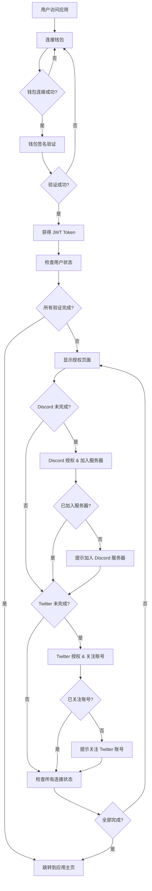

# 前端登录集成指南

## 概述

本指南详细说明了前端应用的完整登录流程，包括钱包连接、Discord/Twitter 授权验证，以及整个用户身份验证的前端实现方案。

## 🎯 完整登录流程概览



## 📋 流程步骤详解

> **⚠️ 重要提示：完整验证要求**
> 
> 本系统要求用户完成以下**所有**验证步骤才能正常使用：
> - ✅ **钱包连接**：连接并验证钱包身份
> - ✅ **Discord 验证**：授权登录 **且** 加入指定 Discord 服务器
> - ✅ **Twitter 验证**：授权登录 **且** 关注指定 Twitter 账号
>
> 只有当 `allConnected: true` 时，用户才能访问完整功能。

### 1. 钱包连接与登录

用户首先需要连接钱包并完成签名验证以获得身份认证。

**流程：**
1. 用户点击"连接钱包"按钮
2. 选择钱包(MetaMask, WalletConnect等)
3. 获取钱包地址
4. 请求签名 nonce
5. 用户钱包签名
6. 验证签名并获得 JWT Token

### 2. 用户状态检查

钱包登录成功后，需要检查用户的 Discord 和 Twitter 连接状态。

**流程：**
1. 使用钱包地址查询用户状态
2. 检查 `discordConnected` 和 `twitterConnected` 状态
3. 检查 `isJoined` (Discord服务器) 和 `isFollowed` (Twitter关注) 状态
4. 根据状态决定是否需要进行授权验证

### 3. Discord/Twitter 授权验证

如果用户尚未完成 Discord 或 Twitter 连接，引导用户进行授权。

**Discord 验证要求：**
- 用户必须授权登录 Discord (`discordConnected`)
- 用户必须加入指定的 Discord 服务器 (`isJoined`)

**Twitter 验证要求：**
- 用户必须授权登录 Twitter (`twitterConnected`)
- 用户必须关注指定的 Twitter 账号 (`isFollowed`)

**流程：**
1. 显示授权页面，列出未完成的连接
2. 用户点击 Discord/Twitter 授权按钮
3. 跳转到对应的 OAuth 页面
4. 用户完成授权后，系统自动检查服务器加入/账号关注状态
5. 更新用户连接状态

### 4. 完成后跳转

所有验证完成后，用户可以正常使用应用功能。

**流程：**
1. 检查 `allConnected` 状态（要求所有条件都满足）
   - `walletConnected: true`
   - `discordConnected: true` && `isJoined: true`
   - `twitterConnected: true` && `isFollowed: true`
2. 如果全部完成，跳转到应用主页
3. 如果部分完成，提示用户完成剩余步骤

## 🔧 核心API接口

### 1. 钱包登录相关

#### 获取签名 Nonce
**接口:** `GET /auth/wallet/nonce?walletAddress=0x...`

**响应:**
```json
{
  "nonce": "abc123def456",
  "message": "Please sign this message to verify your wallet: abc123def456",
  "expiresAt": "2024-01-01T10:40:00.000Z"
}
```

#### 验证钱包签名并登录
**接口:** `POST /auth/wallet/verify`

**请求体:**
```json
{
  "walletAddress": "0x1234...",
  "nonce": "abc123def456",
  "signature": "0x123abc..."
}
```

**响应:**
```json
{
  "verified": true,
  "walletAddress": "0x1234...",
  "access_token": "eyJhbGciOiJIUzI1NiIs...",
  "user": {
    "id": "clj123456789",
    "walletAddress": "0x1234...",
    "discordConnected": false,
    "twitterConnected": false,
    "walletConnected": true,
    "isJoined": false,
    "isFollowed": false,
    "allConnected": false,
    "status": "NORMAL"
  }
}
```

### 2. 用户状态查询

#### 获取用户状态
**接口:** `GET /social/user-status?walletAddress=0x...`

**响应:**
```json
{
  "walletAddress": "0x1234...",
  "discordConnected": false,
  "twitterConnected": false,
  "walletConnected": true,
  "isJoined": false,
  "isFollowed": false,
  "allConnected": false,
  "completedAt": null,
  "nextSteps": [
    {
      "platform": "discord",
      "action": "connect",
      "description": "Connect your Discord account and join the server",
      "completed": false
    },
    {
      "platform": "twitter", 
      "action": "connect",
      "description": "Connect your Twitter account and follow our account",
      "completed": false
    }
  ]
}
```

### 3. Discord 授权相关

#### 获取 Discord OAuth 授权链接
**接口:** `GET /auth/discord/oauth-url?walletAddress=0x...`

**响应:**
```json
{
  "oauthUrl": "https://discord.com/api/oauth2/authorize?client_id=...&redirect_uri=...&response_type=code&scope=identify+guilds&state=...",
  "walletAddress": "0x1234567890123456789012345678901234567890"
}
```

#### Discord OAuth 回调处理
**接口:** `GET /auth/discord/callback?code=...&state=...`

**响应:**
```json
{
  "success": true,
  "discordId": "123456789",
  "username": "user#1234",
  "isInGuild": true,
  "walletAddress": "0x1234567890123456789012345678901234567890",
  "message": "Discord connection successful! You are a member of the 0G Discord server.",
  "note": "isInGuild 必须为 true 才算完成验证"
}
```

#### 检查 Discord 连接状态
**接口:** `GET /auth/discord/status?discordId=123456789`

**响应:**
```json
{
  "connected": true,
  "username": "user#1234",
  "userId": "123456789",
  "verified": true,
  "connectedAt": "2024-01-01T10:30:00.000Z"
}
```

### 4. Twitter 授权相关

#### 获取 Twitter OAuth 授权链接
**接口:** `GET /auth/twitter/oauth-url?walletAddress=0x...`

**响应:**
```json
{
  "oauthUrl": "https://api.twitter.com/oauth/authorize?oauth_token=...",
  "walletAddress": "0x1234567890123456789012345678901234567890"
}
```

#### Twitter OAuth 回调处理
**接口:** `GET /auth/twitter/callback?oauth_token=...&oauth_verifier=...`

**响应:**
```json
{
  "success": true,
  "twitterId": "987654321",
  "username": "dollyuser",
  "isFollowing": true,
  "walletAddress": "0x1234567890123456789012345678901234567890",
  "message": "Twitter connection successful! You are now following our account.",
  "note": "isFollowing 必须为 true 才算完成验证"
}
```

## 🚀 快速开始指南

### 1. 基本集成步骤

1. **安装依赖**
```bash
npm install ethers axios
# 或
yarn add ethers axios
```

2. **复制代码模板**
   - 复制上述 `AuthService` 类到你的项目
   - 复制 `useWalletLogin` 和 `useUserStatus` hooks
   - 复制 `LoginFlow` 组件

3. **配置环境变量**
```bash
# .env.local
NEXT_PUBLIC_API_BASE_URL=http://p01--dolly-vibe-backend--jlqhr9wl7sxr.code.run
```

4. **设置路由**
   - 主登录页面: `/auth`
   - 回调页面: `/auth/discord/callback` 和 `/auth/twitter/callback`

### 2. 关键实现要点

#### 钱包连接最佳实践

```typescript
// 检查钱包是否已连接
const checkWalletConnection = async () => {
  if (window.ethereum) {
    const accounts = await window.ethereum.request({ 
      method: 'eth_accounts' 
    });
    return accounts.length > 0 ? accounts[0] : null;
  }
  return null;
};

// 监听账户变化
useEffect(() => {
  if (window.ethereum) {
    window.ethereum.on('accountsChanged', (accounts) => {
      if (accounts.length === 0) {
        // 用户断开连接
        setWalletAddress(null);
        setIsLoggedIn(false);
      } else {
        // 用户切换账户
        setWalletAddress(accounts[0]);
      }
    });
  }
}, []);
```

#### 状态持久化

```typescript
// 在 localStorage 中保存登录状态
const saveAuthState = (token: string, walletAddress: string) => {
  localStorage.setItem('auth_token', token);
  localStorage.setItem('wallet_address', walletAddress);
};

// 页面刷新时恢复状态
const restoreAuthState = () => {
  const token = localStorage.getItem('auth_token');
  const walletAddress = localStorage.getItem('wallet_address');
  
  if (token && walletAddress) {
    AuthService.setAuthToken(token);
    setWalletAddress(walletAddress);
    setIsLoggedIn(true);
  }
};
```

#### 错误处理

```typescript
const handleAuthError = (error: any) => {
  console.error('Auth error:', error);
  
  // 清理状态
  localStorage.removeItem('auth_token');
  localStorage.removeItem('wallet_address');
  setIsLoggedIn(false);
  setWalletAddress(null);
  
  // 显示用户友好的错误信息
  if (error.code === 4001) {
    setError('用户取消了操作');
  } else if (error.code === -32002) {
    setError('请检查您的钱包，可能有待处理的请求');
  } else {
    setError('连接失败，请重试');
  }
};
```

### 3. 测试和调试

#### 开发环境测试

```typescript
// 添加调试日志
const DEBUG = process.env.NODE_ENV === 'development';

const debugLog = (message: string, data?: any) => {
  if (DEBUG) {
    console.log(`[Auth Debug] ${message}`, data);
  }
};

// 在关键步骤添加日志
debugLog('Starting wallet connection');
debugLog('Nonce received', { nonce, message });
debugLog('Signature created', { signature });
debugLog('Login successful', loginResult);
```

#### 常见问题排查

1. **钱包连接失败**
   - 检查是否安装了 MetaMask
   - 确认网络是否正确
   - 检查控制台错误信息

2. **签名验证失败**
   - 确认 nonce 未过期
   - 检查消息格式是否正确
   - 验证钱包地址是否匹配

3. **OAuth 回调失败**
   - 检查回调 URL 配置
   - 确认 state 参数传递正确
   - 验证服务器端配置

### 4. 部署注意事项

#### 生产环境配置

```bash
# 生产环境变量
NEXT_PUBLIC_API_BASE_URL=http://p01--dolly-vibe-backend--jlqhr9wl7sxr.code.run
DISCORD_REDIRECT_URI=https://yourdomain.com/auth/discord/callback
TWITTER_REDIRECT_URI=https://yourdomain.com/auth/twitter/callback
```

#### 安全考虑

1. **HTTPS 要求**: 生产环境必须使用 HTTPS
2. **域名验证**: 确保回调 URL 域名与配置一致
3. **Token 安全**: 使用 httpOnly cookies 存储敏感信息
4. **CORS 设置**: 正确配置跨域访问

## 📖 总结

本指南提供了完整的前端登录集成方案，包括：

### 核心功能
1. **钱包连接与签名验证** - 安全的身份认证机制
2. **用户状态管理** - 实时跟踪连接状态
3. **OAuth 授权流程** - Discord 和 Twitter 平台集成
4. **回调处理** - 完善的授权结果处理

### 技术要点
- 使用 ethers.js 进行钱包交互
- JWT Token 管理和持久化
- React Hooks 状态管理
- TypeScript 类型安全

### 最佳实践
- 完善的错误处理
- 用户友好的界面反馈
- 移动端兼容性考虑
- 安全的生产环境部署

遵循此指南，你可以快速构建一个完整的 Web3 社交登录系统，为用户提供流畅的认证体验。